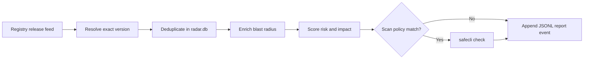

# SafeCLI Release Radar


**SafeCLI tells you whether to trust a package. Release Radar finds the new
packages worth checking first.**

Near-realtime release discovery for SafeCLI.

Radar watches npm and PyPI, resolves exact package versions, ranks releases by
risk and blast radius, and sends high-signal candidates to your local `safecli`
command.

SafeCLI remains the scanner. Radar is the discovery layer.

## Quick Start

Prerequisite: `python3` must already be Python 3.10 or newer. If your default
`python3` is older, point `make` at a newer interpreter explicitly, for
example `make PYTHON=/opt/homebrew/bin/python3.12 install`.
If you already created `.venv` with an older interpreter, `make install` will
recreate it automatically when you switch `PYTHON=...`.

Install SafeCLI first and make sure the `safecli` command works:

```bash
safecli check npm is-number@7.0.0
```

Then install Radar:

```bash
make install
safecli-radar check npm is-number
safecli-radar watch
```

That is the main workflow.

## Why Radar Exists

Package registries like npm and PyPI move faster than manual review.

Most malicious-package discoveries happen after a package has already been
published, installed, or copied into build systems. Scanning every single
release is noisy and expensive, but waiting for takedowns and advisories is too
late.

Radar is built for the decision in the middle:

- which fresh releases should SafeCLI inspect now
- which exact version was published
- which low-risk-looking package has enough blast radius to scan anyway
- which package was skipped, and why

## What It Does

- Watches npm and PyPI release feeds.
- Resolves every candidate to an exact package version.
- Deduplicates releases in a local SQLite database.
- Enriches candidates with downloads and dependent-package signals.
- Performs lightweight static archive triage before spending a SafeCLI scan.
- Runs `safecli check ...` for high-risk or high-impact candidates.
- Appends every cycle, release, score, scan decision, and SafeCLI result to
  `./data/radar-events.jsonl`.

## Commands

Check one package through the Radar pipeline:

```bash
safecli-radar check npm is-number
safecli-radar check pypi requests==2.32.3
```

Poll npm and PyPI once:

```bash
safecli-radar once
```

Run continuously:

```bash
safecli-radar watch
```

Smoke-test one watch cycle and exit:

```bash
safecli-radar watch --max-cycles 1 --no-scan
```

Print the full machine-readable watch payload:

```bash
safecli-radar watch --output json
```

Tail durable progress as Radar works:

```bash
tail -f ./data/radar-events.jsonl
```

Discovery only, without spending SafeCLI scans:

```bash
safecli-radar once --no-scan
```

Tune scan policy:

```bash
safecli-radar watch --scan-threshold 70 --impact-scan-threshold 80
```

Optionally cap SafeCLI scans per cycle if you need spend control:

```bash
safecli-radar watch --max-safecli-per-cycle 10
```

Use a specific SafeCLI provider/config:

```bash
safecli-radar \
  --safecli-provider opencode \
  --safecli-config ./data/safecli-config.json \
  check npm is-number
```

## Scan Policy

Radar scans when static risk is high or impact is high.

Risk score means "does this package look suspicious?" It comes from signals such
as typosquat/name similarity, risky package-name terms, install scripts,
obfuscation-like artifact findings, binary/wheel-only PyPI artifacts, and
release-history oddities.

Impact score means "how bad could it be if this package is bad?" It comes from
blast-radius signals such as npm downloads, direct dependents, indirect
dependents, total dependents, and whether the package name is already on the
popular-package watchlist.

High-impact packages can be scanned even when static risk is low. This matters
because a package with many users or dependents can be dangerous even when the
first-pass risk score looks quiet.

Current always-scan impact triggers include:

- at least 10,000 npm downloads in the last week
- at least 10 direct dependents
- at least 100 indirect dependents
- at least 100 total dependents
- strong name similarity to a popular package

## How It Works



Radar calls SafeCLI externally. It does not replace SafeCLI's graph builder,
provider configuration, verdict cache, or scan artifacts.

The SafeCLI commands Radar runs look like:

```bash
safecli check npm package@version
safecli check pypi package==version
```

## Registry Sources

- npm: public registry change cursor at
  `https://replicate.npmjs.com/registry/_changes?since=<seq>`
- PyPI: RSS for fast recent updates plus XML-RPC changelog serials for
  cursor-based reconciliation
- deps.dev: dependent-package enrichment when available
- npm downloads API: last-week download enrichment for npm packages

## Registry Etiquette

Radar is a polling client, so it should be run politely:

- Default watch interval is 60 seconds.
- Radar does not crawl npmjs.com web pages or enumerate all registry packages.
  It polls registry release/change sources and resolves metadata only for
  changed packages.
- Use `--interval 120` or `--interval 300` if you prefer a slower, more
  conservative daemon.
- Requests use a descriptive `User-Agent`; override it with
  `SAFECLI_RADAR_USER_AGENT` or `--user-agent` if you run this in production.
- HTTP calls retry `429` and transient `5xx` responses with backoff and honor
  `Retry-After` when the registry sends it.
- PyPI XML-RPC changelog catch-up is throttled to every 5 minutes by default.
  Change it with `--pypi-changelog-interval`; `0` checks every cycle.
- SQLite dedupe prevents reprocessing the same exact package version.
- SafeCLI scans are uncapped by default. If you pass `--max-safecli-per-cycle`,
  scan-worthy releases that do not fit in that cycle are retried from the DB on
  later cycles.

## Local Files

Local runtime files are written under `./data/`:

- `radar.db` for release events, cursors, scores, JSONL location, and SafeCLI results
- `radar-events.jsonl` for append-only report/progress records that survive crashes
- optional SafeCLI DB and artifacts when passed through Radar flags

The package archives Radar downloads for triage are temporary. They are not
kept in the repository.

## Terms

Cycle means one polling pass over the configured registry sources. `watch`
normally runs forever and starts a new cycle every `--interval` seconds.
`--max-cycles 1` is only a smoke-test/dev option.
The default `--max-cycles 0` means no stop limit.

Release means one exact package version seen from a registry feed, for example
`npm is-number@7.0.0` or `pypi requests==2.32.3`. The first run on a fresh DB can
see many PyPI RSS entries at once because PyPI exposes a recent-update feed; that
does not mean Radar scanned all of them with SafeCLI.

`new_exact_versions` in watch output means "new to this Radar DB in this cycle",
not "released in this exact minute". PyPI sources can include recent RSS update
items, newest-package RSS items, and XML-RPC changelog catch-up items. Watch
prints `source_counts` so you can see where each cycle's candidates came from.

JSONL is the canonical output stream. Each line is a complete JSON object, so an
agent or another process can read it while Radar is running, and a crash only
risks the record currently being written.

## Development

```bash
make install
make lint
make test
```

## Project Standards

- [Code of Conduct](./CODE_OF_CONDUCT.md)
- [Contributing](./CONTRIBUTING.md)
- [Security](./SECURITY.md)
- [Apache-2.0 License](./LICENSE)
